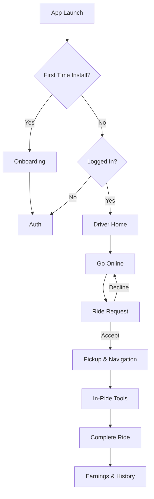

# RidezToHealth Driver

RidezToHealth Driver is a Flutter app for drivers to manage availability, receive ride requests, navigate pickups and destinations, communicate with riders, and track earnings. The app is built with GetX, a feature-first module layout, and a layered services/repository approach to keep UI, business logic, and data access cleanly separated.

**Overview**
- App name: RidezToHealth Driver
- Platforms: iOS, Android, Web, Desktop (Flutter)
- SDK: Flutter with Dart `^3.8.1`
- Version: `1.1.2+2`
- Architecture: Feature-first modules, GetX controllers + repositories + services

**Feature Highlights**
- Driver status toggling with live availability
- Ride request flow with accept/decline actions
- Live map, routing, and pickup/destination context
- In-ride tools including chat and status updates
- Earnings summary and wallet actions
- Ride history with filters and detail cards
- Profile, vehicle details, and account security
- Notifications feed and alert management
- Local storage for tokens and user profile
- Real-time updates via Socket.IO

**Screen Gallery**
Place screenshots in `docs/screenshots/` using the filenames below.
<p></p>
<p></p>

**App Flow**


**Feature Modules**
- `feature/app/` provides the app shell, navigation, and shared layout
- `feature/auth/` handles login, registration, OTP, and password changes
- `feature/home/` manages driver availability and ride request actions
- `feature/map/` covers maps, routing, pickup flow, and in-ride tools
- `feature/earning/` shows earnings summary and wallet views
- `feature/historyAndProfile/` contains ride history, profile, vehicle, and notifications
- `feature/identity/` supports identity and verification-related flows

**Architecture**
- State and dependency management: GetX (`get`)
- Navigation: `GetMaterialApp` with custom bottom navigation
- Feature-first layout: UI, controllers, services, and domain models grouped per feature
- Remote data: `ApiClient` and `SocketClient` under `lib/helpers/remote/`
- Local storage: `shared_preferences` and `get_storage`

**Project Structure**
```
lib/
  main.dart                         # App entry, DI, and initial routing
  app.dart                          # App shell and navigation
  core/                             # Themes, constants, widgets, onboarding
  feature/                          # Feature modules
    app/
    auth/
    earning/
    historyAndProfile/
    home/
    identity/
    map/
  helpers/                          # DI, API client, socket client
  navigation/                       # Navigation widgets
  payment/                          # Payment and wallet utilities
  utils/                            # App-wide constants and helpers
assets/
  images/
  icons/
  fonts/
```

**Dependencies**
- `get` for state, navigation, and DI
- `dio` and `http` for networking
- `socket_io_client` for real-time updates
- `shared_preferences` and `get_storage` for local persistence
- `google_maps_flutter`, `geolocator`, `location`, `geocoding` for map and location features
- `permission_handler` for runtime permissions
- `image_picker` and `file_picker` for media and file uploads
- `cached_network_image`, `shimmer`, `flutter_svg` for UI
- `webview_flutter` and `url_launcher` for embedded and external content
- `camera`, `video_player`, and `path_provider` for media capture and playback
- `device_info_plus` and `package_info_plus` for device and app metadata
- `intl` for formatting and localization
- `motion_tab_bar`, `pinput`, and `font_awesome_flutter` for navigation and UI elements

**Getting Started**
1. Install dependencies:
   ```bash
   flutter pub get
   ```
2. Configure API and Socket URLs in `lib/core/constants/urls.dart`.
3. Configure the Maps API key in `lib/utils/app_constants.dart` and your platform configs.
4. Run the app:
   ```bash
   flutter run
   ```

**Configuration Notes**
- Base URLs and socket settings: `lib/core/constants/urls.dart`
- App constants and keys: `lib/utils/app_constants.dart`
- Launcher icons: `pubspec.yaml` under `flutter_launcher_icons`

Regenerate launcher icons:
```bash
flutter pub run flutter_launcher_icons
```

**Assets and Fonts**
- Images: `assets/images/`
- Icons: `assets/icons/`
- Fonts: `assets/fonts/notoSansKR/` configured in `pubspec.yaml`

**Testing**
```bash
flutter test
```

**Security and Secrets**
Do not commit real API keys or production credentials. Use environment-specific builds or secure config management for secrets.
